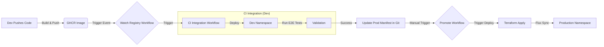

# HelloWorld Infrastructure & GitOps

## 1. Project Overview

This repository hosts the **Infrastructure as Code (IaC)** and **GitOps configurations** for the `helloworld` application. It provides a robust, production-ready platform on AWS EKS, featuring automated deployments, progressive delivery (Canary), and auto-scaling infrastructure.

**Key Capabilities:**
*   **Fully Automated Infrastructure:** EKS clusters, VPCs, and addons provisioned via Terraform.
*   **GitOps Delivery:** Flux CD manages application state, syncing manifests from Git to Kubernetes.
*   **Progressive Delivery:** Flagger automates analysis and promotion of Canary deployments.
*   **Elastic Compute:** Karpenter provides just-in-time, cost-effective node scaling.
*   **Secure Pipelines:** GitHub Actions CI/CD with AWS OIDC authentication (no long-lived keys).

**Target Users:** Platform Engineers, DevOps Engineers, and Developers deploying the `helloworld` microservice.

---

## 2. High-Level Architecture

The system follows a modern **GitOps** architecture on AWS.

1.  **Infrastructure Layer:** Terraform provisions the AWS VPC and EKS Cluster.
2.  **Platform Layer:** Core addons (Karpenter, Load Balancer Controller, External Secrets, Prometheus) are installed as Terraform modules / Helm releases.
3.  **GitOps Layer:** Flux CD runs inside the cluster, watching this repository (`clusters/` directory).
4.  **Application Layer:** The `helloworld` app is packaged as a Helm Chart (`appManifests/`) and deployed via Flux `HelmRelease`.
5.  **CI/CD Layer:** GitHub Actions orchestrates testing (Dev) and promotion (Prod).

---

## 3. Architecture Diagram

```mermaid
graph TD
    subgraph "GitHub (CI/CD)"
        Actions[GitHub Actions]
        Repo[Infrastructure Repo]
        Registry[GHCR Container Registry]
    end

    subgraph "AWS Cloud (eu-west-1)"
        OIDC[IAM OIDC Provider]
        
        subgraph "EKS Cluster"
            Flux[Flux CD Controller]
            Flagger[Flagger Canary Controller]
            Karpenter[Karpenter Scaler]
            
            subgraph "Namespaces"
                Dev[Namespace: helloworld (Dev)]
                Prod[Namespace: helloworld (Prod)]
            end
        end
    end

    Actions -->|Authenticate| OIDC
    Actions -->|Update Config| Repo
    Flux -->|Sync Manifests| Repo
    Flux -->|Pull Chart| Repo
    
    Dev -->|Pull Image| Registry
    Prod -->|Pull Image| Registry
    
    Flagger -->|Traffic Splitting| Dev
    Flagger -->|Traffic Splitting| Prod
    Karpenter -->|Provisions Nodes| EKS Cluster
```

---

## 4. Application Flow Diagram

**From Code Push to Production:**



---

## 5. Folder & File Structure

| Path | Purpose |
| :--- | :--- |
| `.github/workflows/` | CI/CD pipelines (`deploy-infra`, `ci-integration`, `promote`). |
| `appManifests/` | Helm Chart source for the `helloworld` application. |
| `clusters/` | Flux Environment configurations. |
| `├── dev/` | Dev environment `HelmRelease` (target of CI tests). |
| `└── prod/` | Production environment `HelmRelease` (target of Promotion). |
| `terraform/` | Terraform Infrastructure Code. |
| `├── main.tf` | Root input for stack configuration. |
| `├── stacks/viney-infra/` | The live infrastructure stack definition. |
| `└── modules/` | Reusable Terraform modules (vpc, eks, flux, etc.). |

### Critical Files
*   `terraform/stacks/viney-infra/main.tf`: The "Control Center" defines which modules are enabled and their configuration.
*   `.github/workflows/ci-integration.yml`: The logic that tests Dev and Auto-Bumps version for Prod.
*   `clusters/dev|prod/release.yaml`: The Single Source of Truth for which application version is running.

---

## 6. Core Logic Breakdown

### Infrastructure Provisioning
We use a **modular Terraform approach**. The `stacks/viney-infra` directory calls modules to compose the platform.
*   **State Management:** Remote S3 Backend with DynamoDB locking.
*   **Identity:** AWS IAM Roles for Service Accounts (IRSA) map Kubernetes Service Accounts to AWS IAM Roles.

### The CI/CD Pipeline
1.  **Watch Registry:** Detects new Docker images from the application repo.
2.  **CI Integration:**
    *   Authenticates via OIDC.
    *   Connects to the **Dev Cluster**.
    *   Deploys the new image tag to `namespace: helloworld`.
    *   Runs connectivity tests (`curl`).
    *   On success, updates `clusters/prod/release.yaml` via `yq` and Commits.
3.  **Promote (Manual):**
    *   Admin clicks "Run workflow".
    *   Triggers `Terraform Apply` on the Prod workspace.
    *   Flux detects the version change and updates the Production App.

---

## 7. Configuration & Environment Variables

Most configuration is handled via **Terraform Variables** or **Helm Values**.

### Required CI/CD Secrets (GitHub Actions)
| Secret Name | Description |
| :--- | :--- |
| `AWS_ROLE_ARN` | IAM Role ARN for GitHub Actions OIDC Authentication. |
| `GHCR_PAT` | Personal Access Token for reading private packages/images. |

### Environment Control
Terraform uses workspaces (`dev`, `prod`) or variables to switch contexts.
*   `var.environment` (e.g., "dev", "prod"): Controls naming conventions and resource sizing.

---

## 8. Installation & Setup

### Prerequisites
*   AWS CLI v2
*   Terraform v1.5.7+
*   `kubectl` & `helm`
*   Active AWS Credentials (or profile)

### Local Setup (Mac/Linux)

1.  **Clone Repository:**
    ```bash
    git clone https://github.com/damekarv/helloworld-infrastructure.git
    cd helloworld-infrastructure
    ```

2.  **Initialize Terraform:**
    ```bash
    cd terraform/stacks/viney-infra
    terraform init
    ```

3.  **Select Workspace:**
    ```bash
    terraform workspace select dev
    ```

4.  **Plan & Apply:**
    ```bash
    terraform plan -var="environment=dev"
    terraform apply -var="environment=dev"
    ```

5.  **Connect to Cluster:**
    ```bash
    aws eks update-kubeconfig --name dev-helloworld --region eu-west-1
    ```

---

## 9. Usage Guide

### Deploying a New Application Version
Ideally, this is automated by the CI pipeline. To simulate it manually:

1.  **Edit the manifest:**
    Open `clusters/dev/release.yaml` and change `tag: "v0.X.X"`.
2.  **Commit & Push:**
    Flux will pick up the change within 1 minute.
3.  **Verify:**
    ```bash
    kubectl get pods -n nellworld
    ```

### Promoting to Production
1.  Go to **GitHub Actions** tab.
2.  Select **"Promote to Prod"**.
3.  Click **Run workflow**.

---

## 10. Error Handling & Edge Cases

*   **Flux Sync Failures:**
    *   *Symptom:* App version doesn't change.
    *   *Fix:* Check Flux logs: `flux logs -f`. Usually due to Git Auth or YAML syntax errors.
*   **Image Pull Errors (401/403):**
    *   *Symptom:* `ImagePullBackOff`.
    *   *Fix:* Ensure the `ghcr-secret` exists in the `helloworld` namespace and has a valid token.
*   **Terraform Lock:**
    *   *Symptom:* `Error acquiring the state lock`.
    *   *Fix:* Provide the Lock ID to `terraform force-unlock <ID>`.

---

## 11. Performance & Scalability Considerations

*   **Node Scaling:** **Karpenter** is configured. It watches for `Pending` pods and launches nodes that perfectly fit the workload (e.g., correct CPU/RAM mix).
*   **Pod Autoscaling:** Configure `HorizontalPodAutoscaler` (HPA) in the `appManifests/values.yaml` to scale pods based on CPU/Memory usage.
*   **Progressive Delivery:** Flagger allows safe scaling. If a new version causes high latency, it automatically rolls back, preventing performance degradation.

---

## 12. Security Considerations

*   **OIDC Authentication:** No AWS Access Keys are stored in GitHub Secrets. We use ephemeral tokens via `aws-actions/configure-aws-credentials`.
*   **Private Registry:** The EKS cluster uses a specific `kubernetes.io/dockerconfigjson` secret (`ghcr-secret`) to authenticate with GitHub Container Registry.
*   **Network Isolation:** All worker nodes are in private subnets. Access to the Kubernetes API is restricted via IAM.

---

## 13. Testing

Testing is embedded in the `Run E2E Tests` step of the `ci-integration` workflow.

### Test Strategy
1.  **Deployment Verification:** `kubectl wait` ensures pods reach `Ready` state.
2.  **Connectivity Check:** A temporary `port-forward` and `curl` request validates that the application handles HTTP traffic on port 8080.

To run tests locally:
```bash
# Forward local port 8080 to a running pod
kubectl port-forward svc/helloworld-primary 8080:8080 -n helloworld

# In another terminal
curl localhost:8080
```

---

## 14. Future Improvements

*   **Network Policies:** Restrict traffic flow between namespaces (e.g., prevent `default` from talking to `helloworld`).
*   **GitOps for Infrastructure:** Currently, Terraform is run via CI. Moving Terraform to a controller (like Flux Terraform Controller) would enable full GitOps for infrastructure.
*   **Spot Instances:** Configure Karpenter to utilize Spot Instances for non-production environments to reduce costs.
